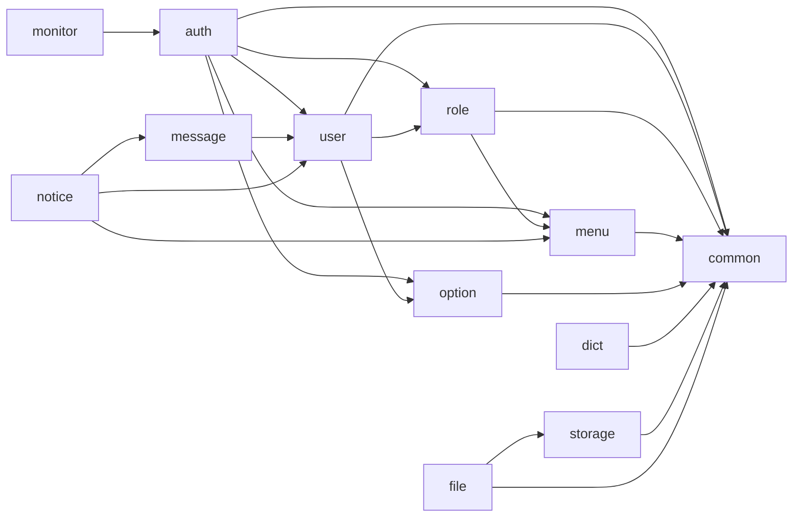

# IDP 后端

基于 Spring Boot 4 的 IDP 后端服务，采用 **Spring Modulith** 进行模块化拆分。

## 技术栈

| 项 | 选型 |
| --- | --- |
| 语言 | Java 21 |
| 框架 | Spring Boot 4 + Spring Modulith 2 |
| 安全 | Spring Security + JWT (jjwt 0.12.x) + BCrypt |
| 持久化 | Spring Data JPA + Hibernate (PostgreSQL) |
| 缓存 / Token | Spring Data Redis + StringRedisTemplate |
| 构建 | Maven (`./mvnw`) |
| 测试 | JUnit 5 + Spring Test + Mockito + H2（测试 profile） |

## 业务模块

按 Spring Modulith 划分，根包为 `com.qvqw.idp`：

```text
com.qvqw.idp
├── common/                        # 共享基础（@OPEN 模块）
│   ├── api/R, PageResp            # 统一响应、分页响应
│   ├── exception/BusinessException, GlobalExceptionHandler
│   ├── persistence/BaseEntity     # 审计字段父类
│   ├── security/UserContext, UserContextHolder    # 跨模块用户上下文
│   └── cache/AuthCacheEvictor                     # 鉴权缓存失效接口
├── auth/                          # 认证模块
│   ├── AuthController             # /auth/login, /auth/logout, /auth/user/info, /auth/captcha
│   └── internal/
│       ├── SecurityConfig         # SecurityFilterChain + CORS + 白名单
│       ├── JwtTokenProvider, TokenStore, JwtAuthenticationFilter
│       ├── CaptchaService, RedisAuthCacheEvictor
│       └── JpaAuditingConfig
├── option/                        # 系统配置
│   ├── OptionService, OptionController, OptionCategory, PasswordPolicy
│   └── internal/OptionRepository, OptionServiceImpl, OptionSeeder
├── menu/                          # 菜单模块（同时承担按钮权限职责）
│   ├── MenuService, MenuController, Menu
│   ├── annotation/@HasPermission              # NamedInterface
│   └── internal/MenuRepository, MenuServiceImpl, MenuAspect, MenuSeeder
├── user/                          # 用户管理
│   ├── UserController             # /system/user CRUD + 改密 + 分配角色 + /profile 个人中心自助改信息
│   ├── UserService, User, UserPasswordHistory
│   └── internal/UserServiceImpl, UserRepository, UserPasswordHistoryRepository, PasswordValidator, AdminSeeder
├── role/                          # 角色管理
│   ├── RoleController             # /system/role CRUD + 分配菜单
│   ├── RoleService, Role, UserRole, RoleMenu
│   └── internal/RoleServiceImpl, RoleRepository, UserRoleRepository, RoleMenuRepository, RoleSeeder, RoleMenuSeeder
├── dict/                          # 字典模块（业务可配置枚举仓库）
│   ├── DictController             # /system/dict/* CRUD + /{code}/item 公开接口
│   ├── DictService, Dict, DictItem
│   └── internal/DictServiceImpl, DictRepository, DictItemRepository, DictSeeder
├── message/                       # 站内消息收件箱
│   ├── MessageController          # /system/message/* 当前用户视角的分页 / 未读数 / 标已读
│   ├── MessageService, Message, MessageLog
│   └── internal/MessageServiceImpl, MessageRepository, MessageLogRepository
├── monitor/                       # 系统监控
│   ├── OnlineUserController       # /monitor/online 在线用户与强退
│   ├── LogController              # /system/log 登录日志 / 操作日志查询与导出
│   ├── OnlineUserService, LogService, OnlineSession, OperationLog
│   └── internal/MonitorEventListener, OnlineUserServiceImpl, LogServiceImpl
├── notice/                        # 通知公告（草稿 / 立即发布 / 定时发布）
│   ├── NoticeController           # /system/notice/* CRUD + popup + read + dashboard
│   ├── NoticeService, Notice, NoticeLog, NoticeScope/NoticeMethod/NoticeStatus
│   └── internal/NoticeServiceImpl, NoticeScheduler, NoticeRepository, NoticeLogRepository
├── storage/                       # 存储引擎（本地 + S3）
│   ├── StorageController          # /system/storage/* CRUD + status + setDefault
│   ├── StorageService, StorageHandler, StorageHandlerFactory, Storage, StorageReferenceChecker
│   └── internal/StorageRepository, StorageServiceImpl, StorageSecretCipher (AES/GCM),
│       LocalStorageHandler, S3StorageHandler, StorageHandlerFactoryImpl, StorageSeeder,
│       LocalStorageResourceConfig
└── file/                          # 文件管理（依赖 storage）
    ├── FileController             # /system/file/* 上传 / 分页 / 统计 / 重命名 / 秒传校验 / 创建文件夹
    ├── FileRecycleController      # /system/file/recycle/* 回收站
    ├── MultipartUploadController  # /system/multipart-upload/* 分片上传
    ├── FileService, FileRecycleService, MultipartUploadService, FileItem, FileTypeEnum
    └── internal/FileRepository, FileServiceImpl, FileRecycleServiceImpl,
        MultipartUploadServiceImpl, MultipartUploadStateCache (Redis),
        ThumbnailGenerator, FileNameGenerator, FileStorageReferenceChecker
```

模块依赖：



要点：

- `common` 标注为 `@ApplicationModule(type = OPEN)`，子包 `api`、`exception`、`persistence`、`security`、`cache` 可被任意模块直接引用。
- `UserContext / UserContextHolder` 放在 `common.security` 而非 `auth`，避免 `menu` AOP 反向依赖 `auth` 形成循环。
- `menu.annotation` 通过 `package-info.java` 标注 `@NamedInterface("annotation")`，允许其他模块在 Controller 上使用 `@HasPermission`。
- `option.model.resp`、`menu.model.resp`、`user.model.resp`、`role.model.resp` 均通过 `@NamedInterface("model")` 暴露给跨模块使用。

## 数据库表

| 表 | 说明 | 关键字段 |
| --- | --- | --- |
| `idp_sys_user` | 用户 | `username unique`, `password (BCrypt)`, `status`, `is_system`, `pwd_reset_at`, `pwd_error_count`, `pwd_locked_until` |
| `idp_sys_role` | 角色 | `code unique`, `sort`, `status`, `is_system` |
| `idp_sys_user_role` | 用户-角色关联 | `user_id`, `role_id`（联合主键） |
| `idp_sys_user_password_history` | 密码历史 | `user_id`, `password_hash`, `created_at`（用于 `PASSWORD_REPETITION_TIMES` 校验） |
| `idp_sys_option` | 系统参数 | `category`, `code`, `option_value`, `default_value`, 联合唯一 `(category, code)` |
| `idp_sys_menu` | 菜单（同时承担按钮权限载体） | `title`, `parent_id`, `type (1=目录/2=菜单/3=按钮)`, `path`, `name`, `component`, `icon`, `is_external/is_cache/is_hidden`, `permission unique`, `sort`, `status`, `is_system` |
| `idp_sys_role_menu` | 角色-菜单关联 | `role_id`, `menu_id`（联合主键） |
| `idp_sys_dict` | 字典 | `code unique`, `name`, `description`, `is_system` |
| `idp_sys_dict_item` | 字典明细 | `dict_id`, `label`, `item_value`（H2 保留字回避）, `color`, `sort`, `status`, `is_system`，联合唯一 `(dict_id, item_value)` |
| `idp_sys_notice` | 通知公告 | `title`, `content`, `type`, `notice_scope`, `notice_users (JSON List<Long>)`, `notice_methods (JSON List<Integer>)`, `is_timing`, `publish_time`, `is_top`, `status` |
| `idp_sys_notice_log` | 公告已读日志 | `notice_id`, `user_id`（联合主键）, `read_time` |
| `idp_sys_message` | 站内消息 | `type`, `title`, `content`, `path` |
| `idp_sys_message_log` | 消息已读日志 | `message_id`, `user_id`（联合主键）, `read_time` |
| `idp_mon_online_session` | 在线用户会话 | `token`, `jti`, `user_id`, `username`, `nickname`, `ip`, `browser`, `os`, `login_time`, `last_active_time` |
| `idp_mon_log` | 登录 / 操作日志 | `trace_id`, `description`, `module`, `time_taken`, `ip`, `status`, `create_user_string`, `create_time`, `request_*`, `response_*` |
| `idp_sys_storage` | 存储引擎 | `name`, `code unique`, `type (1=本地/2=S3)`, `access_key`, `secret_key (AES/GCM)`, `endpoint`, `bucket_name`, `domain`, `recycle_bin_enabled`, `recycle_bin_path`, `is_default`, `sort`, `status` |
| `idp_sys_file` | 文件 / 文件夹 | `name`, `original_name`, `size`, `parent_path`, `path`, `extension`, `content_type`, `type (0=DIR/1=UNKNOWN/2=IMAGE/3=DOC/4=VIDEO/5=AUDIO)`, `sha256`, `metadata`, `thumbnail_name`, `storage_id`, `deleted`, `deleted_by`, `deleted_at` |

启动时由 Seeder 幂等地创建默认数据：
- `RoleSeeder`（@Order(10)）：角色 `admin`、`user`
- `DictSeeder`（@Order(12)）：4 个字典 + 14 条明细（`notice_type` / `notice_scope_enum` / `notice_method_enum` / `notice_status_enum`）
- `MenuSeeder`（@Order(15)）：1 目录 + 6 菜单 + 字典 / 通知公告 / 消息中心相关条目 + 全部按钮
- `RoleMenuSeeder`（@Order(17)）：把全部系统内置菜单绑定到 `admin` 角色
- `AdminSeeder`（@Order(20)）：默认账号 `admin / 123456`（首次启动后请尽快通过接口修改密码）
- `OptionSeeder`（@Order(30)）：15 条 SITE / PASSWORD / LOGIN 默认配置
- `StorageSeeder`（@Order(35)）：默认 `code=local` 本地存储，启用回收站，根目录 `${idp.file.local.base-path}`

> **Breaking change（v2 改造）**：旧表 `idp_sys_permission` / `idp_sys_role_permission` 已下线，由 `idp_sys_menu` / `idp_sys_role_menu` 取代；字段结构变化无法通过 `ddl-auto=update` 平滑迁移，建议 `drop database idp;` 重建后让 Seeder 灌入；自定义角色的菜单绑定需要重新分配。

## 对外 API（核心）

| 方法 | 路径 | 说明 |
| --- | --- | --- |
| POST | `/auth/login` | 账号密码登录（可选验证码） → `{token, expires, passwordExpired?, passwordWarning?, passwordExpiresInDays?}` |
| POST | `/auth/logout` | 注销当前 JWT |
| GET | `/auth/user/info` | 当前登录用户信息（含按钮权限码） |
| GET | `/auth/user/route` | 当前登录用户可见菜单树（前端动态侧边栏数据源） |
| GET | `/auth/captcha` | 获取登录验证码 |
| POST | `/system/user/password` | 当前用户自助改密 |
| PUT | `/system/user/profile` | 当前用户自助修改基本信息（昵称 / 邮箱 / 手机 / 性别） |
| GET | `/system/user` | 用户分页（`page,size,username,status`） |
| GET | `/system/user/{id}` | 用户详情（含角色列表） |
| POST | `/system/user` | 新增用户 |
| PUT | `/system/user/{id}` | 修改用户 |
| DELETE | `/system/user` | 批量删除（body：`{ids:[]}`） |
| PATCH | `/system/user/{id}/password` | 重置密码 |
| PATCH | `/system/user/{id}/role` | 分配角色（body：`{roleIds:[]}`） |
| GET | `/system/role` | 角色分页（`page,size,keyword`） |
| GET | `/system/role/list` | 角色列表（不分页） |
| GET | `/system/role/{id}` | 角色详情 |
| POST | `/system/role` | 新增角色 |
| PUT | `/system/role/{id}` | 修改角色 |
| DELETE | `/system/role` | 批量删除（body：`{ids:[]}`） |
| GET | `/system/role/{id}/user/id` | 角色下用户 ID 列表 |
| GET | `/system/role/{id}/menu` | 角色菜单 ID 列表（含按钮节点） |
| PUT | `/system/role/{id}/menu` | 设置角色菜单（body：`{menuIds:[]}`，admin 角色不允许） |
| GET | `/system/menu` | 菜单平铺列表 |
| GET | `/system/menu/tree` | 菜单树 |
| GET | `/system/menu/{id}` | 菜单详情 |
| POST | `/system/menu` | 新增菜单（目录 / 菜单 / 按钮三种类型） |
| PUT | `/system/menu/{id}` | 修改菜单（内置不可改 type/parentId/permission） |
| DELETE | `/system/menu` | 批量删除（仅非内置；存在子节点拒绝） |
| GET | `/system/option` | 系统参数列表 |
| PUT | `/system/option` | 批量更新参数 |
| PATCH | `/system/option/value` | 重置参数为默认值 |
| POST | `/system/option/image` | 上传 base64 图片 |
| GET | `/system/option/site` | 公开站点配置（白名单） |
| GET | `/system/option/login` | 公开登录配置（白名单） |
| GET | `/system/dict/list` | 字典列表（admin 配置） |
| GET / POST / PUT / DELETE | `/system/dict` 系列 | 字典与明细 CRUD（详见 [`../docs/dict.md`](../docs/dict.md)） |
| GET | `/system/dict/{code}/item` | 公开接口：按 code 取启用明细，前端 `useDict` 调用 |
| GET / POST / PUT / DELETE | `/system/notice` 系列 | 通知公告 CRUD（详见 [`../docs/notice.md`](../docs/notice.md)） |
| GET | `/system/notice/popup` | 当前用户登录弹窗未读公告 |
| POST | `/system/notice/{id}/read` | 标记已读 |
| GET | `/system/notice/dashboard` | Dashboard 最新公告摘要（默认 5 条） |
| GET | `/system/message` | 当前用户消息分页 |
| GET | `/system/message/unread-count` | 当前用户未读数（顶栏 bell） |
| POST | `/system/message/{id}/read`、`/system/message/read-all` | 单条 / 全部已读 |
| GET | `/monitor/online` | 在线用户分页 |
| DELETE | `/monitor/online/{token}` | 强退在线用户 |
| GET | `/system/log` | 登录日志 / 操作日志分页 |
| GET | `/system/log/{id}` | 系统日志详情 |
| GET | `/system/log/export/login`、`/system/log/export/operation` | 导出登录日志 / 操作日志 CSV |
| GET | `/system/storage/list` | 存储列表（按类型 / 关键字过滤） |
| GET | `/system/storage/{id}` | 存储详情（SecretKey 脱敏） |
| POST / PUT / DELETE | `/system/storage` 系列 | 新增 / 修改 / 批量删除 |
| PUT | `/system/storage/{id}/status` | 切换启用 / 禁用 |
| PUT | `/system/storage/{id}/default` | 设为默认存储 |
| POST | `/system/file` | 上传文件（默认 100MB） |
| GET | `/system/file` | 文件分页（类型 / 父目录过滤） |
| PUT | `/system/file/{id}` | 重命名 |
| DELETE | `/system/file` | 批量删除（根据存储 recycleBinEnabled 走回收站 / 物理删除） |
| GET | `/system/file/statistics` | 资源统计 |
| GET | `/system/file/check` | 按 SHA256 校验秒传 |
| POST | `/system/file/dir` | 创建文件夹（自动建中间目录） |
| GET | `/system/file/{id}/size` | 计算文件夹大小 |
| GET / PUT / DELETE | `/system/file/recycle` 系列 | 回收站列表 / 还原 / 物理删除 / 清空 |
| POST / PUT / DELETE | `/system/multipart-upload` 系列 | 分片上传 init / part / complete / cancel |

详细设计参见 [`../docs/auth.md`](../docs/auth.md)、[`../docs/user-role.md`](../docs/user-role.md)、[`../docs/system-config.md`](../docs/system-config.md)、[`../docs/menu.md`](../docs/menu.md)、[`../docs/dict.md`](../docs/dict.md)、[`../docs/notice.md`](../docs/notice.md)、[`../docs/message.md`](../docs/message.md)、[`../docs/file-storage.md`](../docs/file-storage.md) 与 [`../docs/monitor.md`](../docs/monitor.md)。

## OpenAPI / Swagger UI

集成 `springdoc-openapi-starter-webmvc-ui v3`，所有对外接口都会自动生成可视化文档：

| 入口 | 路径 |
| --- | --- |
| Swagger UI | <http://localhost:8080/swagger-ui.html> |
| OpenAPI JSON | <http://localhost:8080/v3/api-docs> |
| OpenAPI YAML | <http://localhost:8080/v3/api-docs.yaml> |

> 全局已注册 JWT `bearerAuth` 安全方案：在 Swagger UI 右上角 “Authorize” 中填入 `/auth/login` 拿到的 token（不带 `Bearer ` 前缀）即可调试需要登录的接口。

强制要求（详见 `.cursor/rules/api-doc-comments.mdc`）：

- Controller 类必须加 `@Tag`；每个 endpoint 必须加 `@Operation`；路径 / Query 参数加 `@Parameter`。
- 请求 / 响应 DTO 与字段必须加 `@Schema`；必填字段加 `requiredMode = REQUIRED`。
- 不需要 JWT 的接口（如登录 / 登出）使用 `@SecurityRequirements` 显式关闭全局安全要求。
- 全局 OpenAPI 定义集中维护在 `com.qvqw.idp.common.config.OpenApiConfig`。

生产可通过 `springdoc.api-docs.enabled=false` / `springdoc.swagger-ui.enabled=false` 关闭暴露。

## 配置

`src/main/resources/application.properties`：

```properties
spring.datasource.url=jdbc:postgresql://localhost:5432/idp
spring.datasource.username=idp
spring.datasource.password=idp
spring.data.redis.host=localhost
spring.data.redis.port=6379
idp.auth.jwt.secret=${IDP_JWT_SECRET:idp-default-jwt-secret-key-please-override-in-production-environment}
idp.auth.jwt.expires=3600
spring.servlet.multipart.max-file-size=100MB
spring.servlet.multipart.max-request-size=100MB
idp.file.local.base-path=${user.home}/.idp/files
idp.storage.secret-key-cipher=${IDP_STORAGE_CIPHER:idp-default-storage-cipher-please-override}
```

> 生产部署务必通过环境变量覆盖默认值：`IDP_JWT_SECRET` 与 `IDP_STORAGE_CIPHER`（用于加密落库 S3 Secret Key）。

测试环境通过 `application-test.properties` 切到 H2 + 弱化 Redis（在集成测试中以 `@MockitoBean StringRedisTemplate` 替代）。

## 常用命令

```bash
./mvnw spring-boot:run     # 本地启动（需先 docker compose up -d）
./mvnw test                # 运行所有 *Test.java
./mvnw verify              # 等同 test，但更明确地走完整生命周期
./mvnw spring-boot:build-image
```

## 开发约定

1. **新增功能 = 新增测试**：所有 Service、Controller、Repository 必须附带 JUnit 测试。
2. **跨模块通信只能通过模块根包**：`auth`、`user`、`role` 之间不可直接引用对方的 `internal/`。
3. **新增功能 = 更新文档**：变更对外接口或模块边界时同步更新本 README 与 `docs/`。
4. 详见根目录 `.cursor/rules/feature-workflow.mdc`。
