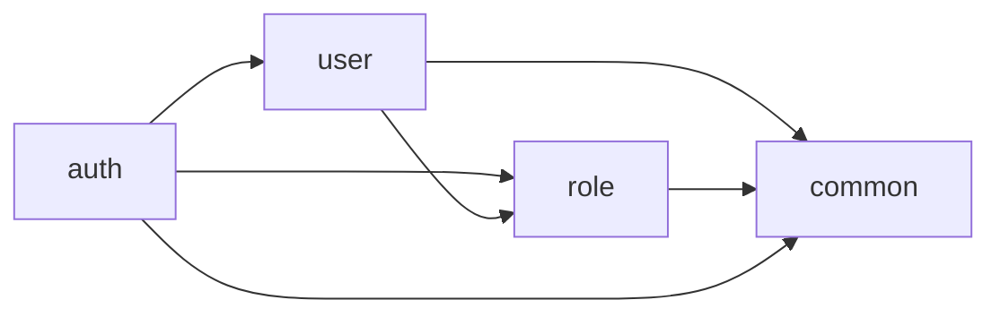

# IDP 后端

基于 Spring Boot 4 的 IDP 后端服务，采用 **Spring Modulith** 进行模块化拆分。

## 技术栈

| 项 | 选型 |
| --- | --- |
| 语言 | Java 21 |
| 框架 | Spring Boot 4 + Spring Modulith 2 |
| 安全 | Spring Security + JWT (jjwt 0.12.x) + BCrypt |
| 持久化 | Spring Data JPA + Hibernate (PostgreSQL) |
| 缓存 / Token | Spring Data Redis + StringRedisTemplate |
| 构建 | Maven (`./mvnw`) |
| 测试 | JUnit 5 + Spring Test + Mockito + H2（测试 profile） |

## 业务模块

按 Spring Modulith 划分，根包为 `com.qvqw.idp`：

```text
com.qvqw.idp
├── common/                        # 共享基础（@OPEN 模块）
│   ├── api/R, PageResp            # 统一响应、分页响应
│   ├── exception/BusinessException, GlobalExceptionHandler
│   └── persistence/BaseEntity     # 审计字段父类
├── auth/                          # 认证模块
│   ├── AuthController             # /auth/login,/auth/logout,/auth/user/info
│   ├── UserContext, UserContextHolder
│   └── internal/
│       ├── SecurityConfig         # SecurityFilterChain + CORS
│       ├── JwtTokenProvider       # JWT 签发与解析
│       ├── JwtAuthenticationFilter
│       ├── TokenStore             # Redis: idp:auth:token:{jti}
│       └── JpaAuditingConfig
├── user/                          # 用户管理
│   ├── UserController             # /system/user CRUD + 重置密码 + 分配角色
│   ├── UserService, User
│   └── internal/UserServiceImpl, UserRepository, AdminSeeder
└── role/                          # 角色管理
    ├── RoleController             # /system/role CRUD
    ├── RoleService, Role, UserRole
    └── internal/RoleServiceImpl, RoleRepository, UserRoleRepository, RoleSeeder
```

模块依赖：



`common` 标注为 `@ApplicationModule(type = OPEN)`，允许其子包（`api`、`exception`、`persistence`）被任意模块直接引用；`user.model.resp` 与 `role.model.resp` 通过 `@NamedInterface("model")` 暴露给跨模块使用（`UserDetailResp`/`RoleResp`）。

## 数据库表

| 表 | 说明 | 关键字段 |
| --- | --- | --- |
| `idp_sys_user` | 用户 | `username unique`, `password (BCrypt)`, `status`, `is_system`, `pwd_reset_at` |
| `idp_sys_role` | 角色 | `code unique`, `sort`, `status`, `is_system` |
| `idp_sys_user_role` | 用户-角色关联 | `user_id`, `role_id`（联合主键） |

启动时由 `RoleSeeder` + `AdminSeeder` 幂等地创建默认数据：
- 角色：`admin`、`user`
- 默认账号：`admin / 123456`（首次启动后请尽快通过接口修改密码）

## 对外 API（核心）

| 方法 | 路径 | 说明 |
| --- | --- | --- |
| POST | `/auth/login` | 账号密码登录 → `{token, expires}` |
| POST | `/auth/logout` | 注销当前 JWT |
| GET | `/auth/user/info` | 当前登录用户信息 |
| GET | `/system/user` | 用户分页（`page,size,username,status`） |
| GET | `/system/user/{id}` | 用户详情（含角色列表） |
| POST | `/system/user` | 新增用户 |
| PUT | `/system/user/{id}` | 修改用户 |
| DELETE | `/system/user` | 批量删除（body：`{ids:[]}`） |
| PATCH | `/system/user/{id}/password` | 重置密码 |
| PATCH | `/system/user/{id}/role` | 分配角色（body：`{roleIds:[]}`） |
| GET | `/system/role` | 角色分页（`page,size,keyword`） |
| GET | `/system/role/list` | 角色列表（不分页） |
| GET | `/system/role/{id}` | 角色详情 |
| POST | `/system/role` | 新增角色 |
| PUT | `/system/role/{id}` | 修改角色 |
| DELETE | `/system/role` | 批量删除（body：`{ids:[]}`） |
| GET | `/system/role/{id}/user/id` | 角色下用户 ID 列表 |

详细设计参见 [`../docs/auth.md`](../docs/auth.md) 与 [`../docs/user-role.md`](../docs/user-role.md)。

## 配置

`src/main/resources/application.properties`：

```properties
spring.datasource.url=jdbc:postgresql://localhost:5432/idp
spring.datasource.username=idp
spring.datasource.password=idp
spring.data.redis.host=localhost
spring.data.redis.port=6379
idp.auth.jwt.secret=${IDP_JWT_SECRET:idp-default-jwt-secret-key-please-override-in-production-environment}
idp.auth.jwt.expires=3600
```

> 生产部署务必通过 `IDP_JWT_SECRET` 环境变量覆盖默认 JWT 密钥。

测试环境通过 `application-test.properties` 切到 H2 + 弱化 Redis（在集成测试中以 `@MockitoBean StringRedisTemplate` 替代）。

## 常用命令

```bash
./mvnw spring-boot:run     # 本地启动（需先 docker compose up -d）
./mvnw test                # 运行所有 *Test.java
./mvnw verify              # 等同 test，但更明确地走完整生命周期
./mvnw spring-boot:build-image
```

## 开发约定

1. **新增功能 = 新增测试**：所有 Service、Controller、Repository 必须附带 JUnit 测试。
2. **跨模块通信只能通过模块根包**：`auth`、`user`、`role` 之间不可直接引用对方的 `internal/`。
3. **新增功能 = 更新文档**：变更对外接口或模块边界时同步更新本 README 与 `docs/`。
4. 详见根目录 `.cursor/rules/feature-workflow.mdc`。
