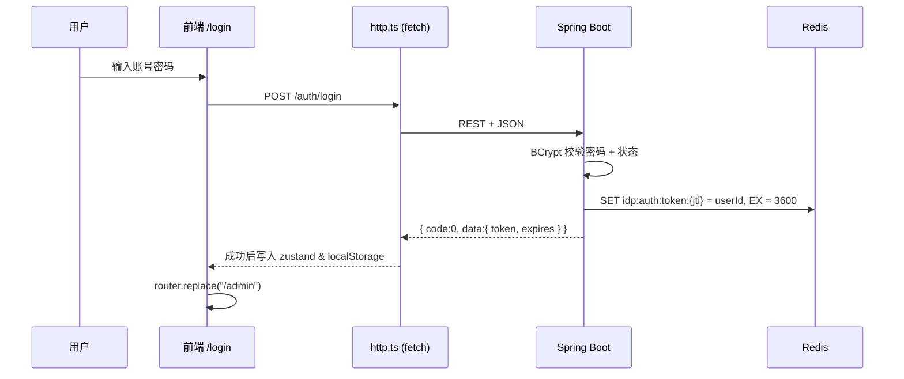
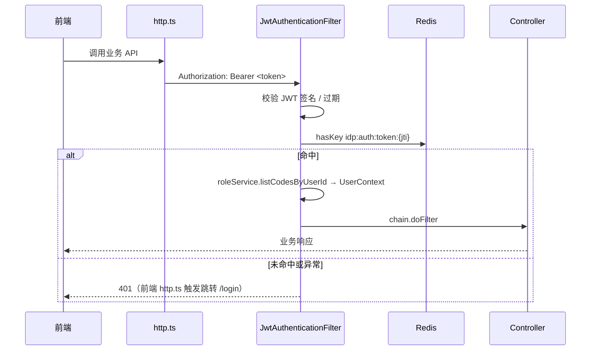

# 认证与登录设计

## 概览

- 认证方式：账号 / 密码 → 后端发放 **JWT**（HS256）。
- Token 持久化：前端写入浏览器 `localStorage`（`idp-auth` key，由 zustand persist 中间件维护）。
- 后端有效性校验：JWT 仅作签名 / 过期校验，**真正的失效控制由 Redis** 完成（登出时删除 jti）。
- 跨域：开发环境后端开放 `http://localhost:3000` 来源。

## 登录流程



## 受保护接口请求



## JWT 设计

| 项 | 值 |
| --- | --- |
| 算法 | HS256 |
| `iss` | `idp` |
| `sub` | 用户 ID（字符串） |
| `username` | 用户名（自定义 claim） |
| `iat` | 签发时间 |
| `exp` | 过期时间（默认 1 小时，可通过 `idp.auth.jwt.expires` 配置） |
| `jti` | 随机 UUID，作为 Redis key 的一部分 |
| 密钥 | `idp.auth.jwt.secret`（生产请通过 `IDP_JWT_SECRET` 环境变量覆盖） |

## Redis Key 规范

| Key | Value | TTL | 说明 |
| --- | --- | --- | --- |
| `idp:auth:token:{jti}` | `userId` (字符串) | 与 JWT 过期一致 | 命中即视为有效；登出时删除 |

## 接口

| 方法 | 路径 | 鉴权 | 说明 |
| --- | --- | --- | --- |
| POST | `/auth/login` | 否 | body：`{ username, password }`，返回 `{ token, expires }` |
| POST | `/auth/logout` | 是 | 解析 `Authorization` 中的 jti 并删除 Redis 记录 |
| GET | `/auth/user/info` | 是 | 返回当前登录用户的基础信息与角色编码列表 |

成功响应统一为：

```json
{
  "code": 0,
  "msg": "success",
  "data": { "...": "..." },
  "timestamp": 1700000000000
}
```

业务错误使用非 0 `code`，由前端 `http.ts` 抛出 `HttpError`。

## 放行清单

`SecurityConfig` 显式放行以下路径，无需 JWT：

- `/auth/login`、`/auth/logout`
- `/error`
- Swagger / OpenAPI: `/v3/api-docs/**`、`/swagger-ui/**`、`/swagger-ui.html`
- Spring Boot Actuator: `/actuator/**`

其余请求一律要求合法 JWT，否则返回 `401`。

## 默认账号

启动时由 `RoleSeeder` + `AdminSeeder` 幂等初始化：

| 项 | 值 |
| --- | --- |
| 用户名 | `admin` |
| 密码 | `123456` |
| 角色 | `admin` |
| 标记 | `is_system = true`（不可删除/不可禁用） |
