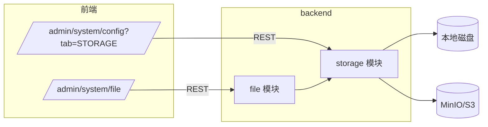
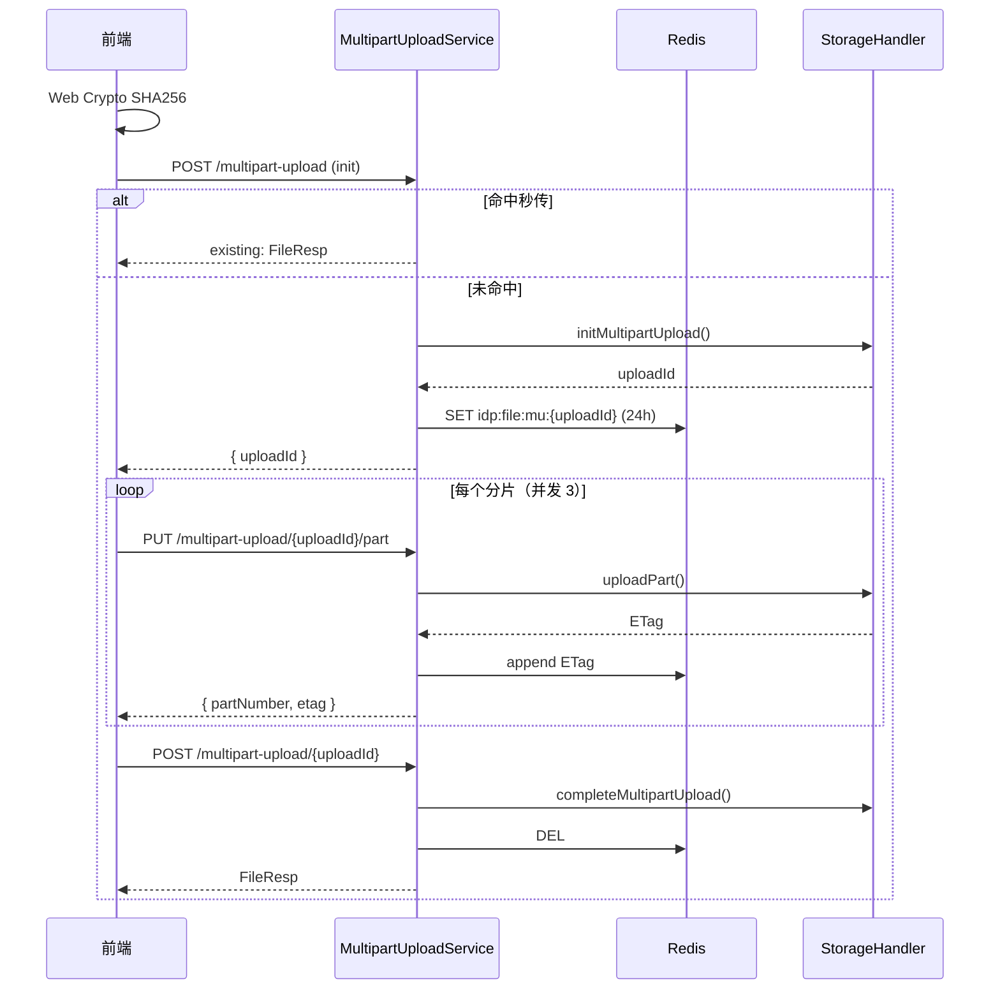
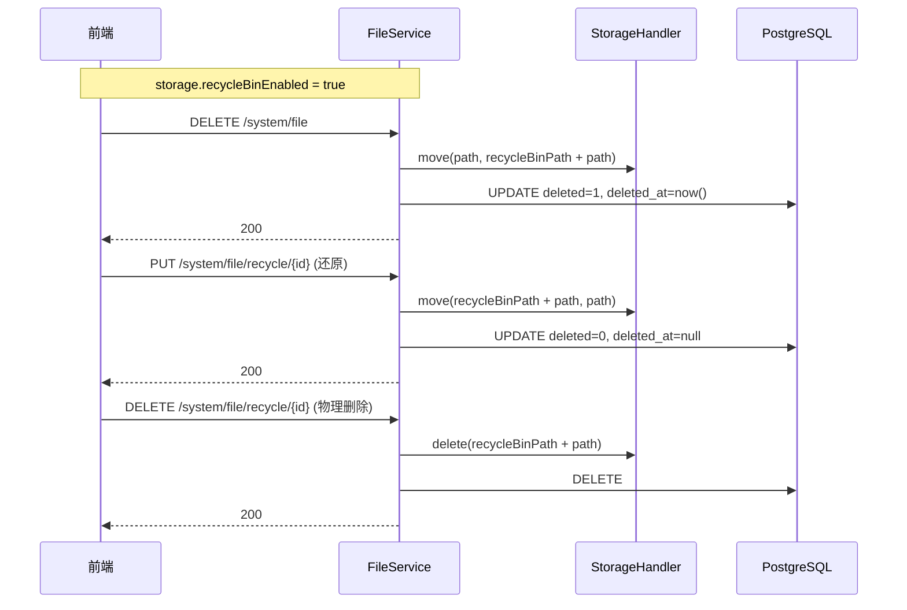

# 文件管理与存储

> 模块代号：`storage` + `file`
> 路由：`/admin/system/file`、`/admin/system/config?tab=STORAGE`
> 适用版本：v0.x

IDP 内置一套企业级的 “文件管理” 与 “存储配置”，对齐 `continew-admin` 的核心能力，按 idp 的 JPA + Spring Modulith + Next.js / Tailwind 风格重写。

## 一、模块架构



设计要点：

- 模块边界严格 —— `file` 通过 `storage` 模块根包暴露的 `StorageService` / `StorageHandlerFactory` / `StorageHandler` 接口跨模块协作，不依赖 `internal.*`。
- `storage` 模块的 `StorageReferenceChecker` 设计为可选 SPI，如未启用 `file` 模块，回落到默认实现允许直接删除。
- 文件元数据持久化到 PostgreSQL，分片上传状态短期存在 Redis（24h TTL，故障时回退到内存 Map）。

## 二、数据模型

### `idp_sys_storage`

| 字段                | 类型         | 说明 |
| ------------------- | ------------ | ---- |
| `id`                | `bigint`     | 主键 |
| `name`              | `varchar`    | 名称 |
| `code`              | `varchar`    | 编码（唯一） |
| `type`              | `smallint`   | 1=本地，2=S3 |
| `access_key`        | `varchar`    | S3 Access Key |
| `secret_key`        | `varchar`    | S3 Secret Key（AES/GCM 加密落库） |
| `endpoint`          | `varchar`    | S3 endpoint，如 `http://localhost:9000` |
| `bucket_name`       | `varchar`    | 本地存储为绝对路径；S3 为 bucket 名 |
| `domain`            | `varchar`    | 可选，访问域名 |
| `recycle_bin_enabled` | `boolean`  | 是否启用回收站 |
| `recycle_bin_path`  | `varchar`    | 回收站路径前缀 |
| `description`       | `varchar`    | 备注 |
| `is_default`        | `boolean`    | 是否默认存储 |
| `sort`              | `int`        | 排序 |
| `status`            | `smallint`   | 1=启用，2=禁用 |
| `created_at` / `updated_at` / `created_by` / `updated_by` | — | 继承自 `BaseEntity` |

### `idp_sys_file`

| 字段              | 类型         | 说明 |
| ----------------- | ------------ | ---- |
| `id`              | `bigint`     | 主键 |
| `name`            | `varchar`    | 后端存储用名（去重 / 物理路径） |
| `original_name`   | `varchar`    | 用户上传原名 |
| `size`            | `bigint`     | 字节 |
| `parent_path`     | `varchar`    | 父目录，以 `/` 开头不以 `/` 结尾 |
| `path`            | `varchar`    | 完整路径 `parent_path + '/' + name` |
| `extension`       | `varchar`    | 扩展名 |
| `content_type`    | `varchar`    | MIME |
| `type`            | `smallint`   | 0=DIR,1=UNKNOWN,2=IMAGE,3=DOC,4=VIDEO,5=AUDIO |
| `sha256`          | `varchar`    | 文件 SHA256，用于秒传 |
| `metadata`        | `varchar`    | 自定义元数据（JSON） |
| `thumbnail_name`  | `varchar`    | 缩略图存储名 |
| `storage_id`      | `bigint`     | 关联 `idp_sys_storage.id` |
| `deleted`         | `int`        | 0=正常，1=回收站 |
| `deleted_by`      | `bigint`     | 删除人 ID |
| `deleted_at`      | `timestamp`  | 删除时间 |

## 三、REST 接口

### 存储管理 `/system/storage`

| 方法 | 路径 | 权限码 | 说明 |
| ---- | ---- | ------ | ---- |
| GET  | `/list` | `system:storage:list` | 存储列表 |
| GET  | `/{id}` | `system:storage:get` | 详情 |
| POST | ``    | `system:storage:add` | 新增 |
| PUT  | `/{id}` | `system:storage:update` | 修改（SecretKey 留空表示不修改） |
| DELETE | ``   | `system:storage:delete` | 批量删除（默认存储 / 被引用时拒绝） |
| PUT  | `/{id}/status` | `system:storage:updateStatus` | 启用 / 禁用 |
| PUT  | `/{id}/default` | `system:storage:setDefault` | 设为默认 |

### 文件管理 `/system/file`

| 方法 | 路径 | 权限码 | 说明 |
| ---- | ---- | ------ | ---- |
| POST | ``   | `system:file:upload` | 普通上传 |
| GET  | ``   | `system:file:list` | 文件分页 |
| PUT  | `/{id}` | `system:file:update` | 重命名 |
| DELETE | ``   | `system:file:delete` | 批量删除 |
| GET  | `/statistics` | `system:file:list` | 资源统计 |
| GET  | `/check` | `system:file:upload` | 秒传校验 |
| POST | `/dir` | `system:file:createDir` | 创建文件夹 |
| GET  | `/{id}/size` | `system:file:calcDirSize` | 计算文件夹大小 |

### 回收站 `/system/file/recycle`

| 方法 | 路径 | 权限码 | 说明 |
| ---- | ---- | ------ | ---- |
| GET  | ``   | `system:fileRecycle:list` | 回收站分页 |
| PUT  | `/{id}` | `system:fileRecycle:restore` | 还原 |
| DELETE | `/{id}` | `system:fileRecycle:delete` | 物理删除 |
| DELETE | ``   | `system:fileRecycle:clean` | 清空 |

### 分片上传 `/system/multipart-upload`

| 方法 | 路径 | 权限码 | 说明 |
| ---- | ---- | ------ | ---- |
| POST | ``   | `system:file:upload` | 初始化（命中 SHA256 直接秒传） |
| PUT  | `/{uploadId}/part` | `system:file:upload` | 上传单个分片 |
| POST | `/{uploadId}` | `system:file:upload` | 合并 + 入库 |
| DELETE | `/{uploadId}` | `system:file:upload` | 取消并清理 |

## 四、关键流程

### 分片上传



### 回收站



## 五、MinIO 部署

### 1. 启动 MinIO

`compose.yaml` 已加入 `minio` 服务，本地启动：

```bash
docker compose up -d minio
```

启动后：

- API：`http://localhost:9000`
- 控制台：`http://localhost:9001`
- 默认账号：`idp` / `idp-minio-password`

### 2. 创建 bucket

进入控制台后：

1. 用默认账号登录；
2. 进入 “Buckets” → “Create Bucket”，建一个名为 `idp` 的 bucket；
3. 在 IDP 后台 “系统配置 → 存储配置” 新增一条 S3 存储：
   - 类型：对象存储
   - Endpoint：`http://localhost:9000`
   - Bucket：`idp`
   - Access Key：`idp`
   - Secret Key：`idp-minio-password`
   - 可选：访问域名 `http://localhost:9000/idp`，回收站路径 `/.recycle`
4. （可选）将该存储 “设为默认” —— 之后文件管理页的所有上传都会走 MinIO。

### 3. SecretKey 安全

- 落库前会用 `AES/GCM` 加密，配置项 `idp.storage.secret-key-cipher`（环境变量 `IDP_STORAGE_CIPHER`）作为对称密钥；
- 生产环境务必通过环境变量覆盖默认值；
- 接口返回时 `SecretKey` 永远脱敏为 `******`；编辑表单留空表示保持原值。

## 六、本地存储

默认会启动一条 `code=local` 的本地存储：

- 路径：`${idp.file.local.base-path}`，默认 `~/.idp/files`
- 访问域名：`http://localhost:8080/file/local/`（通过 Spring `WebMvcConfigurer` 暴露为静态资源）
- 自动启用 + 设为默认 + 启用回收站

## 七、前端

- `/admin/system/file`：双列布局（FileAside 分类 + FileMain 列表）
- `/admin/system/config` 的 `STORAGE` Tab：本地 / 对象 子分组卡片网格 + 添加 / 编辑 modal
- 分片上传：Web Crypto SHA256，默认 5MB 分片、3 个并发；断点续传通过 sessionStorage 记录已成功的 partNumber。

### 在线预览

| 类型 | 实现 | 说明 |
| ---- | ---- | ---- |
| 图片 | 自研 lightbox | 支持当前页内图片左右切换、键盘 ←/→/Esc、缩放、旋转、重置 |
| 视频 | 原生 `<video>` | 受浏览器解码能力限制，推荐使用 mp4 / webm |
| 音频 | 原生 `<audio>` | mp3 / wav / ogg 通用 |
| PDF | 浏览器内置 PDF 阅读器（`<iframe>`） | 不依赖三方库 |
| DOCX | [`docx-preview`](https://www.npmjs.com/package/docx-preview) | 浏览器本地解析，不上传到外部服务 |
| XLSX | [`xlsx`](https://www.npmjs.com/package/xlsx)（SheetJS） | 多 sheet 切换 + HTML table 渲染 |
| PPT / 其他 | 兜底视图 | 提示不支持，提供 "下载" 与 "新标签页打开" 两个入口 |

`OfficePreview` 与 `ImagePreview` 均基于 Portal 渲染到 `document.body`，Esc 键统一关闭。

## 八、切换默认存储后的可用性

- 每个文件实体 `idp_sys_file.storage_id` 记录上传时所属存储，**切换默认存储不会改写已存在文件的归属**；
- `FileServiceImpl.toResp()` 始终按文件自身的 `storageId` 解析 URL，因此一份 LOCAL 文件 + 一份 S3 文件可以并存，展示链路互不影响；
- `LocalStorageResourceConfig` 启动时会遍历 **所有** LOCAL 类型存储，把 `domain` 路径段映射到对应磁盘目录，只要该 LOCAL 存储记录还在，旧文件 URL 就一直可用；
- `StorageReferenceChecker` 会拦截 "被引用" 的存储删除请求，从根上避免出现野指针式的失效 URL；
- 注意点：运行时**新增**的 LOCAL 存储，Spring MVC 静态资源映射不会动态加载，需要重启服务才能让该 `domain` 生效。

## 九、注意事项

- 文件夹删除要求非空，避免误删递归内容。
- 文件夹和子文件必须在同一个存储 —— 上传到子目录时会复用该目录的 `storageId`。
- `recycleBinPath` 必须以 `/` 开头，且与正常路径独立，避免名称冲突。
- 上传体积默认 100MB，配置项 `spring.servlet.multipart.max-file-size` / `max-request-size`。
