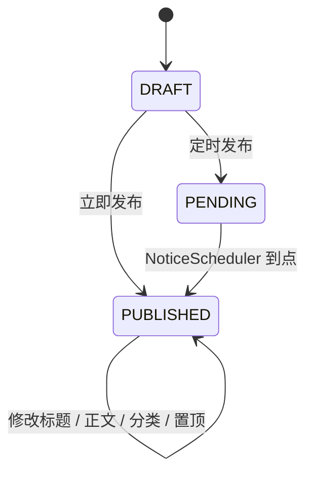
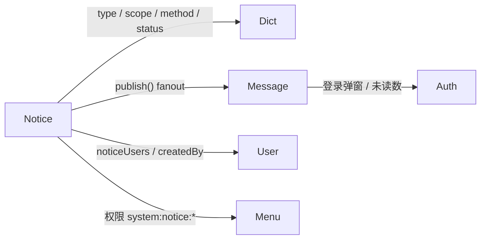

## 通知公告模块（notice）

通知公告（Notice）用于向 IDP 内部用户广播站内消息。它与 [字典模块](dict.md)（分类 / 状态等枚举）、[站内消息模块](message.md)（fanout 收件箱）协同工作，是 IDP 中第一个 “以发布为副作用” 的业务模块。

整体能力对齐 continew-admin 的 `sys_notice`，并按 IDP 现有 JPA + Spring Modulith 风格做了精简：

- 草稿 / 立即发布 / 定时发布 三态状态机；
- 通知范围支持 全员（ALL） / 指定用户（USER）；
- 通知方式可选 站内消息 / 弹窗（多选）；
- 已读追踪：`idp_sys_notice_log` 复合主键 `(notice_id, user_id, read_time)`；
- 定时发布：进程内 `@Scheduled` 轮询 `status=PENDING && publish_time<=now` 的公告自动置 `PUBLISHED`；
- Dashboard / 顶栏弹窗 / 顶栏未读数三条 “消费入口” 复用同一组接口。

---

### 1. 数据模型

`idp_sys_notice`

| 字段 | 类型 | 说明 |
| --- | --- | --- |
| id | bigint, PK | 主键 |
| title | varchar(150) | 标题 |
| content | text | 正文，纯文本 / Markdown，前端用 `<pre>` 保留换行展示 |
| type | varchar(30) | 公告分类，对应字典 `notice_type` 的 `value` |
| notice_scope | int | 1=全员、2=指定用户，对应字典 `notice_scope_enum` |
| notice_users | text | `notice_scope=2` 时存 `List<Long>` 的 JSON 序列化结果，由 `LongListJsonConverter` 完成转换；为了兼容 H2 测试，未使用 PG 的 `jsonb` |
| notice_methods | text | 通知方式集合：`[1=SYSTEM_MESSAGE, 2=POPUP]`，`IntegerListJsonConverter` 完成转换 |
| is_timing | boolean | 是否定时发布 |
| publish_time | timestamp | 发布时间：立即发布 = `save()` 当下；定时发布 = 计划时间；草稿 = `null` |
| is_top | boolean | 是否置顶（列表与 Dashboard 都按 `is_top DESC` 排序） |
| status | int | 1=草稿、2=待发布（定时）、3=已发布，对应字典 `notice_status_enum` |
| created_by / created_at / updated_at | 审计 |  |

`idp_sys_notice_log` 复合主键 `(notice_id, user_id)`，字段 `read_time`：

- `noticeScope=ALL` 的公告，缺记录视为未读；
- `noticeScope=USER` 的公告，`notice_users` 与 `idp_sys_notice_log` 双索引保证有数据库行级一致性；
- 删除公告时一并 `deleteByNoticeIds(ids)` 清掉 log。

> **JSON 列**：早期方案使用 Hibernate 7 的 `@JdbcTypeCode(SqlTypes.JSON)` 落到 PG 的 `jsonb`，但 H2 在测试 profile 下不支持，因此最终切换到 `TEXT + Jackson` 的 `AttributeConverter`，前后端零感知。

---

### 2. 状态机



约束：

- 已发布的公告 **不允许** 修改 `noticeScope` / `noticeMethods` / `noticeUsers` / `isTiming` / `publishTime`，避免重新触发分发；
- 定时发布要求 `publishTime` 不能早于当前时间；
- 删除支持批量，会联动清理 `idp_sys_notice_log`。

---

### 3. 接口

| 方法 | 路径 | 鉴权 | 说明 |
| --- | --- | --- | --- |
| GET | `/system/notice` | `system:notice:list` | 分页查询（title 模糊 + type + status） |
| GET | `/system/notice/{id}` | `system:notice:list` | 详情（含 `content` / `noticeUsers`） |
| POST | `/system/notice` | `system:notice:add` | 新增（依据 `status` + `isTiming` 推导草稿 / 待发布 / 已发布） |
| PUT | `/system/notice/{id}` | `system:notice:update` | 修改（已发布锁定通知范围 / 方式 / 定时） |
| DELETE | `/system/notice` | `system:notice:delete` | 批量删除并联动清理 `notice_log` |
| GET | `/system/notice/popup` | 已登录 | 当前用户未读且 method=POPUP 的公告，用于登录弹窗 |
| POST | `/system/notice/{id}/read` | 已登录 | 标记已读 |
| GET | `/system/notice/dashboard` | 已登录 | Dashboard 摘要（默认 5 条，最多 50） |

> 所有需要鉴权的接口走 `@HasPermission` + AOP；详见 [菜单模块文档](menu.md#312-接口)。

---

### 4. 定时发布

`IdpApplication` 添加 `@EnableScheduling`，`NoticeScheduler#tick` 以 `fixedDelay=60s` 轮询：

```java
@Scheduled(fixedDelay = 60_000)
public void tick() {
    for (Long id : noticeService.listPendingDueIds()) {
        noticeService.publishNow(id);
    }
}
```

`publishNow(id)`：

1. 仅当状态仍是 `PENDING` 时才推进；
2. 置 `status=PUBLISHED`，必要时回填 `publishTime=now()`；
3. 若 `noticeMethods` 含 `SYSTEM_MESSAGE`，调用 `MessageService.publish` fanout 收件箱。

多实例部署时如需保证唯一调度，可在 `NoticeScheduler` 外层加 Redis 分布式锁（当前 IDP 默认单实例运行）。

---

### 5. 前端

- API 客户端：`frontend/src/lib/api/notice.ts`；
- 字典 Hook：`useDict("notice_type"|"notice_scope_enum"|"notice_method_enum"|"notice_status_enum")`，由 `frontend/src/lib/hooks/use-dict.ts` 实现并缓存 5 分钟；
- 页面：
  - `/admin/system/notice` 列表 + 搜索 + 删除；
  - `/admin/system/notice/add?type=update&id=xxx` 新增 / 编辑；
  - `/admin/system/notice/view?id=xxx` 预览；
- 组件：
  - `NoticeDetailDrawer` 右侧抽屉，复用 `DictBadge` 渲染分类 / 范围 / 方式 / 状态；
  - `UserMultiSelect` 指定用户多选下拉，分页拉 `/system/user` 一千条；
  - `NoticePopup` 在 `/admin/layout.tsx` 内首次进入时 fetch `/system/notice/popup` 弹出 Modal，依次浏览并自动调 `/read` 标记已读，会话内通过 `sessionStorage` 防重复弹出；
  - `NotificationBell` 顶栏小红点 + 未读列表（消费 `/system/message/unread-count` + `/system/message`）。

---

### 6. 与其他模块的关系



- `UserService` 暴露 `listEnabledUserIds()` 用于全员 fanout；`mapDisplayNames(ids)` 用于列表 / 详情显示发布人；
- `DictService` 启动时由 `DictSeeder` 预烘四套字典：`notice_type` / `notice_scope_enum` / `notice_method_enum` / `notice_status_enum`，前端各处直接复用 `DictBadge` 渲染颜色与标签；
- `MessageService.publish(req, userIds)`：`userIds=null` 时取全体启用用户 fanout。

---

### 7. 注意事项

- **正文渲染**：当前用 `<pre className="whitespace-pre-wrap">` 渲染换行；如果业务需要富文本 / Markdown，再引入 `react-markdown` 与白名单后处理（XSS）。
- **公告范围切换**：`USER → ALL` 或反向都视为大改，必须在草稿态完成；前端编辑页对应禁用了已发布场景下的范围选择。
- **`notice_users` 一旦命中 `noticeScope=USER`，请确保填入非空** —— 服务层会显式拒绝空数组，避免 “指定用户但谁都收不到” 的尴尬。
- **测试库注意点**：H2 reserved keywords（如 `value`）需要重命名物理列；本模块使用 `idp_sys_dict_item.item_value` 而非 `value`，遇到 schema 报错时优先排查保留字。
