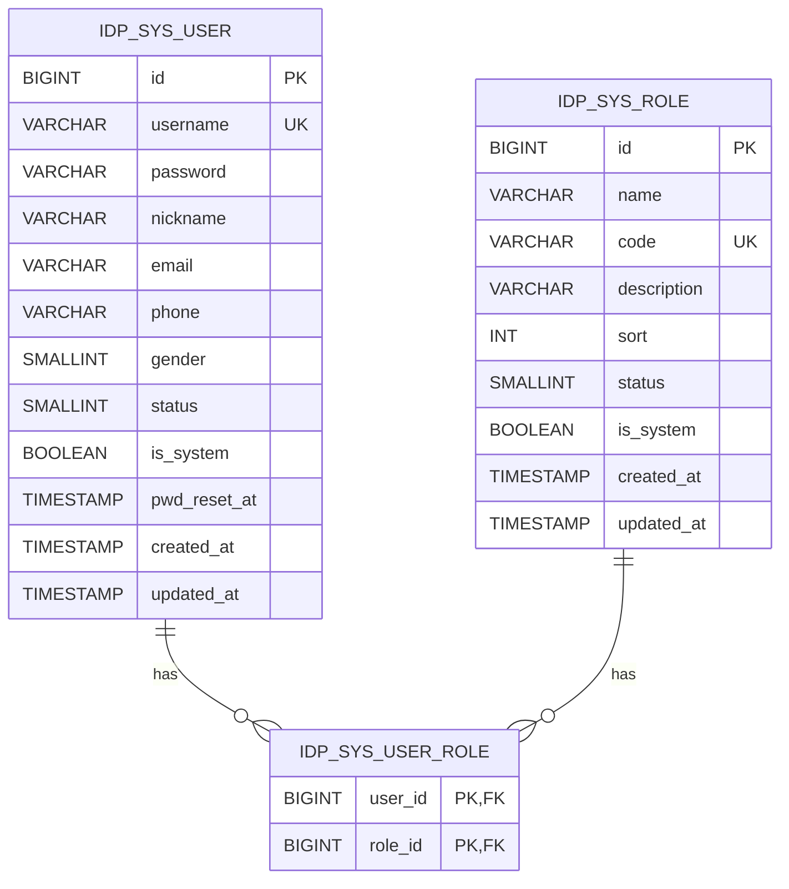

# 用户与角色管理

## 实体关系



字段约定：

- `status`: `1` = 启用，`0` = 禁用。
- `gender`: `0` = 未知，`1` = 男，`2` = 女。
- `is_system`: 系统内置数据保护标记。
  - 系统内置角色不允许删除、不允许修改 `code`。
  - 系统内置用户不允许删除、不允许禁用。

## 用户接口

| 方法 | 路径 | 说明 |
| --- | --- | --- |
| GET | `/system/user?page=1&size=10&username=&status=` | 用户分页列表 |
| GET | `/system/user/{id}` | 用户详情（含 `roleIds` / `roleCodes` / `roleNames`） |
| POST | `/system/user` | 新增用户。可选 `roleIds[]` 同时分配角色 |
| PUT | `/system/user/{id}` | 修改用户基础信息及角色分配（用户名不可修改） |
| DELETE | `/system/user` | 批量删除（body：`{ ids: [] }`），同时清理用户-角色关联 |
| PATCH | `/system/user/{id}/password` | 重置密码（body：`{ newPassword }`） |
| PATCH | `/system/user/{id}/role` | 单独分配角色（body：`{ roleIds: [] }`） |

请求/响应字段示例：

```jsonc
// POST /system/user
{
  "username": "alice",
  "password": "123456",
  "nickname": "Alice",
  "email": "alice@example.com",
  "phone": "13800000000",
  "gender": 2,
  "status": 1,
  "roleIds": [2]
}
```

```jsonc
// GET /system/user/1
{
  "code": 0,
  "msg": "success",
  "data": {
    "id": 1,
    "username": "admin",
    "nickname": "超级管理员",
    "status": 1,
    "isSystem": true,
    "roleIds": [1],
    "roleCodes": ["admin"],
    "roleNames": ["超级管理员"]
  }
}
```

## 角色接口

| 方法 | 路径 | 说明 |
| --- | --- | --- |
| GET | `/system/role?page=1&size=10&keyword=` | 角色分页 |
| GET | `/system/role/list` | 角色列表（不分页，可选 `status` 过滤） |
| GET | `/system/role/{id}` | 角色详情 |
| POST | `/system/role` | 新增角色 |
| PUT | `/system/role/{id}` | 修改角色（系统内置角色不允许修改 `code`） |
| DELETE | `/system/role` | 批量删除（系统内置 / 已分配用户的角色不允许删除） |
| GET | `/system/role/{id}/user/id` | 角色下用户 ID 列表 |

```jsonc
// POST /system/role
{
  "name": "运维",
  "code": "ops",
  "description": "运维同学",
  "sort": 10,
  "status": 1
}
```

## 校验规则

- `username`：以字母开头，仅可包含字母、数字、下划线，长度 2-64。
- `password`：长度 6-32（明文上送，后端 BCrypt 哈希）。
- `email`：符合邮箱格式（可空）。
- `phone`：空字符串或 `^1[3-9]\d{9}$`。
- `code`：以字母开头，仅可包含字母、数字、下划线。

校验失败统一返回 `400 + {code:400, msg:"..."}`，由 `GlobalExceptionHandler` 处理。

## 权限码命名约定（预留）

虽然本期暂未实现菜单/权限点，但保留 `UserInfoResp.permissions` 字段，后续约定权限码格式：

```text
<模块>:<资源>:<动作>
```

例如：`system:user:create`、`system:role:update`、`system:user:resetPassword`。

## 前端实现要点

- 用户列表 / 角色列表均使用 `lib/api/*` 客户端 + React Query。
- 用户表单 (`components/system/user-form.tsx`) 同时复用于"新增/编辑"，编辑时隐藏用户名 / 密码字段。
- 用户重置密码使用独立 Modal + 单独表单 (`user-password-form.tsx`)，要求二次确认。
- 角色多选使用按钮组方式，所选 ID 同步到 React Hook Form 的 `roleIds` 字段。
